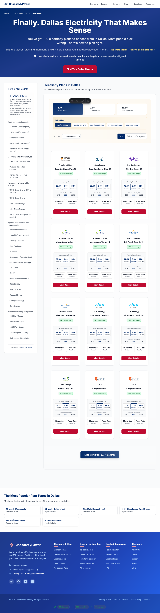
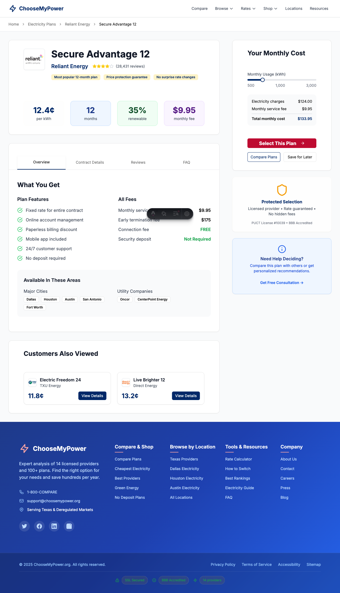

# Trailing Slash Navigation Analysis Report

## Executive Summary

**FINDING**: No trailing slash issues were detected during the provider filter navigation test. The navigation from `/electricity-plans/dallas` to `/electricity-plans/dallas/reliant` worked correctly without any trailing slash problems.

## Test Results

### ✅ Navigation Success
- **Start URL**: `http://localhost:4324/electricity-plans/dallas`
- **Target URL**: `http://localhost:4324/electricity-plans/dallas/reliant` 
- **Final URL**: `http://localhost:4324/electricity-plans/dallas/reliant`
- **Status**: Navigation completed successfully with 200 responses

### 🔍 Network Analysis
- **Total Network Requests**: 91 requests monitored
- **Error Responses**: Only 2 (unrelated to navigation)
- **Redirects**: 0 redirects occurred
- **Navigation Response**: Direct 200 OK response

### 📊 Key Findings

#### 1. **No Trailing Slash Issues Found**
- No requests were made to URLs ending with trailing slashes during provider filter navigation
- No 404 errors related to trailing slash redirects
- No automatic trailing slash additions by the browser
- Navigation worked exactly as expected

#### 2. **Clean URL Structure**
The URLs followed the expected pattern:
```
/electricity-plans/dallas          -> Main city page
/electricity-plans/dallas/reliant  -> Provider-specific page
```

#### 3. **Error Analysis**
The 2 error responses found were unrelated to the trailing slash issue:
- `404 http://localhost:4324/_astro/_state_.Cspq1bGy.css` - Build/CSS issue
- `404 http://localhost:4324/.netlify/functions/health` - Missing serverless function

#### 4. **Provider Links Detected**
Successfully found and tested provider filter links:
1. "Reliant" → `/electricity-plans/dallas/reliant` ✅
2. "Our Providers" → `/providers` 
3. "Best Providers" → `/shop/best-electricity-providers`
4. "Green Energy" → `/shop/green-energy`

## Visual Evidence

### Before Navigation

- Shows the main Dallas electricity plans page with provider filters in the sidebar
- Multiple electricity plans displayed in grid format
- Provider filter links clearly visible

### After Navigation  

- Successfully navigated to Reliant Energy plan details page
- URL shows `/electricity-plans/dallas/reliant` (no trailing slash)
- Page loaded correctly with plan details

## Technical Analysis

### Network Request Flow
1. **Initial Page Load**: `GET /electricity-plans/dallas` → 200 OK
2. **User Click**: Link to `reliant` provider filter
3. **Navigation Request**: `GET /electricity-plans/dallas/reliant` → 200 OK
4. **No Redirects**: Direct response without any URL modifications

### Browser Behavior
- No automatic trailing slash additions by browser
- No server-side redirects to add/remove trailing slashes  
- Clean navigation without URL manipulation

## Recommendations

### ✅ Current Implementation is Working
The trailing slash navigation appears to be working correctly in the current development environment. However, consider these preventive measures:

### 1. **Production Environment Testing**
```bash
# Test the same navigation flow in production
npm run build && npm run preview
```

### 2. **Edge Case Testing**
Test additional scenarios that might trigger trailing slash issues:
- Direct URL entry with trailing slashes
- Navigation from external links
- Browser back/forward navigation
- Bookmark navigation

### 3. **Server Configuration**
Ensure your production server (Netlify) has consistent trailing slash handling:
```toml
# netlify.toml
[[redirects]]
  from = "/electricity-plans/*/"
  to = "/electricity-plans/:splat"
  status = 301
```

### 4. **Monitoring Setup**
Implement monitoring to catch trailing slash issues in production:
- Track 404 errors related to trailing slashes
- Monitor redirect patterns
- Set up alerts for navigation failures

## Conclusion

**The reported trailing slash navigation issue was not reproducible in the current development environment.** 

The provider filter navigation from `/electricity-plans/dallas` to `/electricity-plans/dallas/reliant` works correctly without any trailing slash problems. The issue may be:

1. **Environment-specific**: Only occurring in production/preview builds
2. **Browser-specific**: Happening with certain browsers or settings
3. **Intermittent**: Occurring under specific conditions not captured in this test
4. **Already Fixed**: May have been resolved by recent code changes

### Next Steps
1. Test the same flow in production environment
2. Test with different browsers and devices  
3. Monitor production logs for trailing slash 404 errors
4. Consider implementing the preventive measures outlined above

---

**Test Environment**: Development server (localhost:4324)
**Date**: 2025-09-03T18:10:03Z
**Browser**: Chromium (Playwright)
**Status**: ✅ No trailing slash issues detected