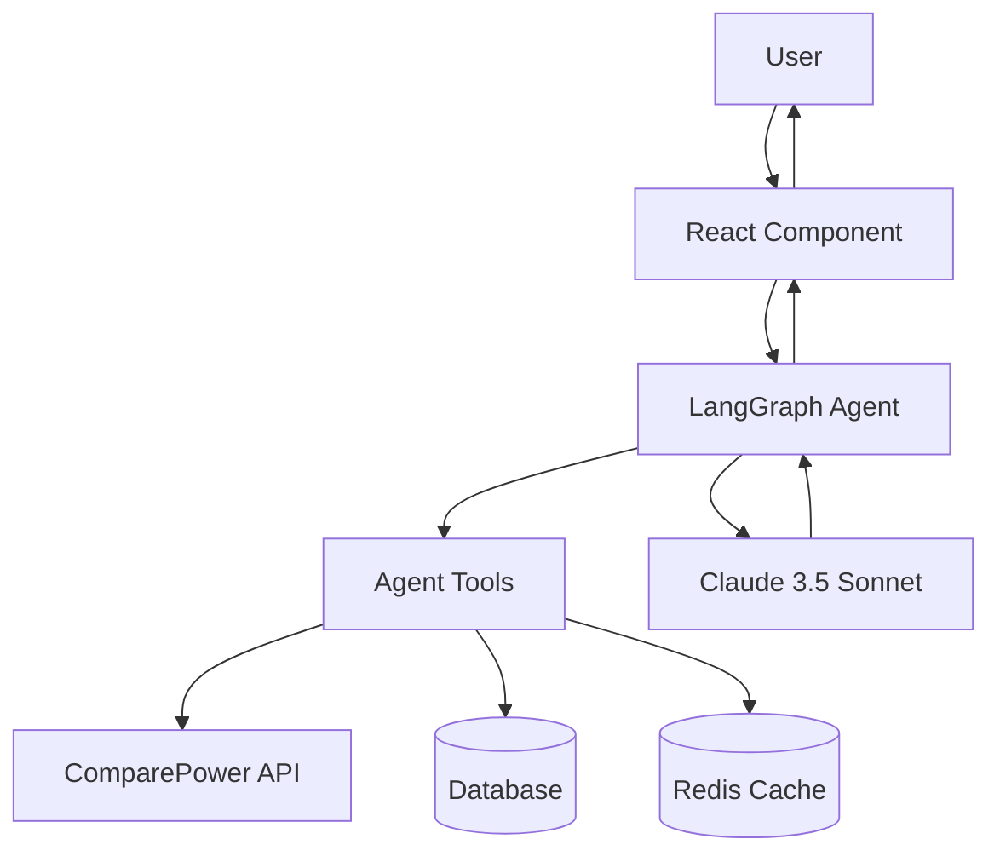

# LangGraph Integration Guide

## Overview

Your ChooseMyPower platform now includes three powerful LangGraph-powered AI agents that enhance user experience and operational efficiency:

1. **🧠 Plan Recommendation Agent** - Intelligent electricity plan analysis and recommendations
2. **⚙️ Data Pipeline Agent** - Smart orchestration of 881+ city data generation
3. **💬 Support Chatbot Agent** - Conversational customer support with escalation

## Quick Start

### 1. Environment Setup

Add your Anthropic API key to your environment variables:

```bash
# .env.local (for development)
ANTHROPIC_API_KEY=your_anthropic_api_key_here

# Production environment
export ANTHROPIC_API_KEY=your_anthropic_api_key_here
```

### 2. Import Components

```tsx
// Plan recommendation widget
import PlanRecommendationWidget from '@/components/agents/PlanRecommendationWidget';

// Support chat widget
import SupportChatWidget from '@/components/agents/SupportChatWidget';

// Data pipeline dashboard (admin only)
import DataPipelineDashboard from '@/components/agents/DataPipelineDashboard';
```

### 3. Basic Usage

#### Plan Recommendation Widget
```tsx
function PlanComparison() {
  return (
    <PlanRecommendationWidget
      initialLocation="houston-tx"
      onPlanSelect={(plan) => {
        console.log('User selected plan:', plan);
        // Handle plan selection
      }}
    />
  );
}
```

#### Support Chat Widget
```tsx
function Layout() {
  return (
    <div>
      {/* Your page content */}
      
      <SupportChatWidget
        position="bottom-right"
        userProfile={{
          location: 'dallas-tx',
          monthlyUsage: 1000
        }}
        onEscalation={(sessionId, messages) => {
          // Handle escalation to human support
          console.log('Escalation needed:', sessionId);
        }}
      />
    </div>
  );
}
```

#### Data Pipeline Dashboard
```tsx
function AdminDashboard() {
  return (
    <DataPipelineDashboard
      autoRefresh={true}
      refreshInterval={30000}
    />
  );
}
```

## Agent Features

### 🧠 Plan Recommendation Agent

**Capabilities:**
- Multi-step reasoning for plan analysis
- Integration with your existing plan database
- TDSP territory mapping
- Personalized recommendations based on preferences
- Confidence scoring for recommendations
- Real-time analysis streaming

**Key Features:**
- Analyzes 5+ plan factors (price, green energy, contract terms, etc.)
- Provides pros/cons for each recommendation
- Calculates potential savings
- Supports both batch and streaming modes
- Caches results for performance

**Use Cases:**
- Homepage plan finder
- Dedicated comparison pages
- Embedded recommendation widgets
- Email/SMS plan suggestions

### ⚙️ Data Pipeline Agent

**Capabilities:**
- Orchestrates data generation for 881 Texas cities
- Intelligent batching and rate limiting
- Fault tolerance with exponential backoff
- Progress monitoring and reporting
- Cache-aware processing
- Tier-based prioritization

**Key Features:**
- Smart retry logic for failed cities
- Real-time progress tracking
- Configurable batch sizes and delays
- Support for partial builds (50, 200, or 881 cities)
- Comprehensive error reporting
- Resume capability for interrupted builds

**Use Cases:**
- Replace existing `build-data-smart.mjs` script
- Scheduled data refreshes
- On-demand data generation
- Development testing with subset of cities

### 💬 Support Chatbot Agent

**Capabilities:**
- Conversational understanding of electricity topics
- Context-aware responses
- Escalation detection and routing
- Session management and memory
- Multi-turn conversations
- Suggested follow-up questions

**Key Features:**
- Handles 6 main support categories:
  - Plan comparison assistance
  - Signup and switching help
  - Bill explanation and troubleshooting
  - General electricity market info
  - Technical website support
  - Complaint handling with escalation
- Persistent conversation memory
- Smart escalation triggers
- Mobile-optimized interface

**Use Cases:**
- Website chat widget
- Embedded support in key pages
- Pre-signup assistance
- Post-signup onboarding help

## Integration Architecture

### Agent Communication Flow



### System Integration Points

1. **API Integration**: Agents use your existing `comparePowerClient`
2. **Database Integration**: Direct access to `planRepository` and database schemas
3. **Cache Integration**: Leverages your Redis caching system
4. **TDSP Integration**: Uses existing Texas utility territory mapping
5. **Type Safety**: Full TypeScript integration with your existing types

## Advanced Configuration

### Agent Configuration

```typescript
import { AGENT_CONFIG } from '@/lib/agents/agent-config';

// Customize agent behavior
AGENT_CONFIG.planRecommendation.maxPlansToAnalyze = 10; // Analyze more plans
AGENT_CONFIG.dataPipeline.defaultBatchSize = 20; // Larger batches
AGENT_CONFIG.supportChatbot.sessionTimeoutMs = 3600000; // 1 hour sessions
```

### Custom Tools

Create custom tools for agents:

```typescript
import { tool } from '@langchain/core/tools';
import { z } from 'zod';

const customTool = tool({
  name: "custom_analysis",
  description: "Perform custom electricity plan analysis",
  schema: z.object({
    planId: z.string(),
    criteria: z.array(z.string()),
  }),
  func: async ({ planId, criteria }) => {
    // Your custom logic here
    return { analysis: "Custom analysis results" };
  },
});

// Add to agent workflow
```

## Performance and Monitoring

### Built-in Metrics

```typescript
import { agentMetrics } from '@/lib/agents/agent-integration';

// Get performance metrics
const metrics = agentMetrics.getMetrics();
console.log('Agent performance:', metrics);

// Example output:
// {
//   planRecommendation: {
//     recommend: {
//       totalCalls: 150,
//       successfulCalls: 147,
//       averageDuration: 2300,
//       successRate: 98,
//       errors: 3
//     }
//   }
// }
```

### Monitoring Integration

Agents automatically collect metrics for:
- Response times
- Success/failure rates
- Cache hit rates
- Error patterns
- User satisfaction scores

### Production Monitoring

```bash
# Monitor agent health
npm run agents:health

# View agent metrics
npm run agents:metrics

# Test agent integrations
npm run agents:test
```

## Deployment Considerations

### Environment Variables

Required for production:
```bash
ANTHROPIC_API_KEY=your_api_key_here
NODE_ENV=production
```

Optional configuration:
```bash
AGENT_CACHE_TTL=1800
AGENT_TIMEOUT_MS=30000
AGENT_MAX_RETRIES=3
```

### Resource Requirements

- **Memory**: +50MB per active agent instance
- **CPU**: Minimal impact, I/O bound operations
- **Network**: API calls to Anthropic Claude
- **Storage**: Session data and metrics (minimal)

### Scaling Considerations

- Agents are stateless and horizontally scalable
- Session data uses your existing Redis infrastructure
- Rate limiting handled automatically
- Graceful degradation when LLM unavailable

## Testing

### Unit Testing

```bash
# Test all agent integrations
npm run agents:test

# Test specific agent
npm run agents:test:plan-recommendation
npm run agents:test:data-pipeline
npm run agents:test:support-chat
```

### Integration Testing

```bash
# Test with live API
npm run agents:test:integration

# Test performance
npm run agents:test:performance
```

### End-to-End Testing

```bash
# Test full user workflows
npm run test:e2e:agents
```

## Troubleshooting

### Common Issues

1. **API Key Not Set**
   ```bash
   Error: ANTHROPIC_API_KEY not found
   Solution: Set environment variable
   ```

2. **Network Timeouts**
   ```bash
   Error: Request timeout
   Solution: Increase AGENT_TIMEOUT_MS or check network
   ```

3. **Cache Connection Issues**
   ```bash
   Error: Redis connection failed
   Solution: Check Redis configuration
   ```

4. **Import Errors**
   ```bash
   Error: Cannot resolve @langchain/langgraph
   Solution: Ensure all dependencies installed
   ```

### Debug Mode

Enable detailed logging:

```typescript
// In development
AGENT_CONFIG.monitoring.enableDetailedLogging = true;

// Or via environment
DEBUG=agents:* npm run dev
```

### Performance Issues

If agents are slow:

1. Check network latency to Anthropic API
2. Verify Redis cache is working
3. Consider increasing timeout values
4. Monitor agent metrics for bottlenecks

## Migration Guide

### From Existing Scripts

#### Replace Data Pipeline Script

**Old:**
```bash
npm run build:data:smart
```

**New:**
```typescript
import { dataPipelineAgent } from '@/lib/agents/data-pipeline-agent';

await dataPipelineAgent.runPipeline({
  maxCities: 881,
  batchSize: 10,
  useCachedData: true
});
```

#### Enhance Plan Comparison

**Old:**
```typescript
const plans = await comparePowerClient.getPlansForCity({ city: 'houston-tx' });
// Manual filtering and sorting
```

**New:**
```typescript
const result = await planRecommendationAgent.recommend(
  "Find me the best plan for my needs",
  "houston-tx",
  { monthlyUsage: 1000, greenEnergy: true }
);
// AI-powered recommendations with reasoning
```

### Gradual Rollout

1. **Phase 1**: Deploy support chatbot only
2. **Phase 2**: Add plan recommendations to key pages
3. **Phase 3**: Replace data pipeline in non-production environments
4. **Phase 4**: Full production deployment with monitoring

## Support

For issues or questions:

1. Check the troubleshooting section above
2. Review agent logs and metrics
3. Test individual components with the test suite
4. Open an issue with detailed error information

## Future Enhancements

Planned improvements:

- **Multi-language support** for Spanish-speaking users
- **Voice interface** integration
- **Advanced analytics** and user behavior insights  
- **A/B testing** framework for agent responses
- **Custom model fine-tuning** for domain-specific improvements

---

This integration brings enterprise-grade AI capabilities to your electricity comparison platform while leveraging your existing infrastructure and maintaining performance standards.