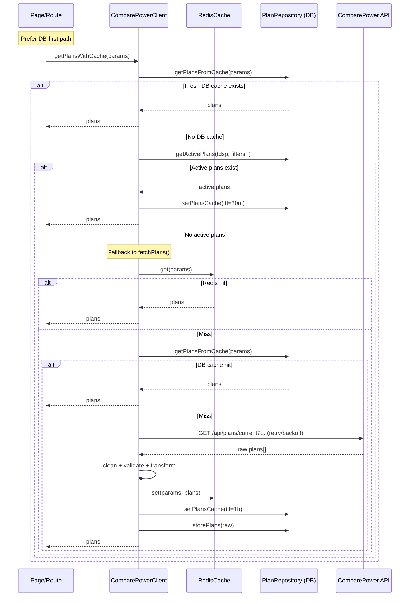
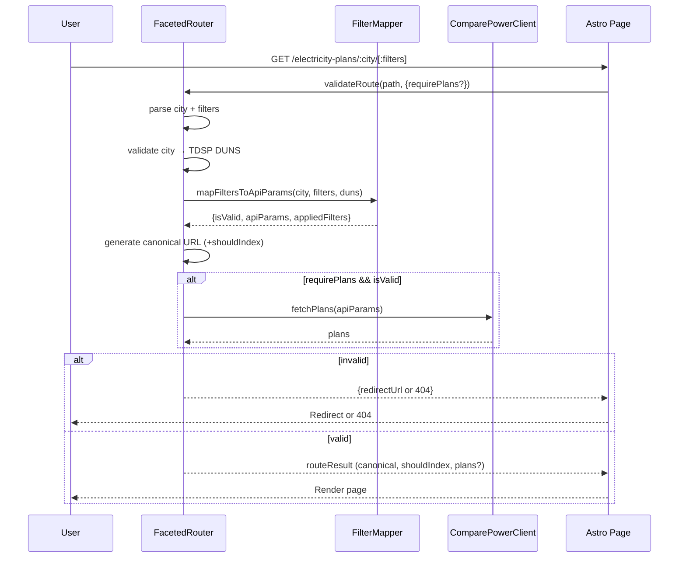
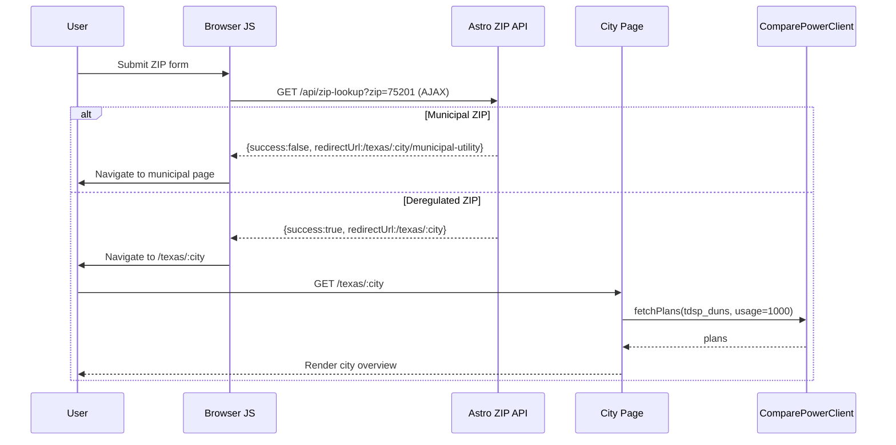

# Architecture Flow Diagrams (Developer Guide)

This page summarizes the three critical runtime flows with compact sequence diagrams and direct code references you can jump to while debugging.

## Plan Fetching & Caching

Code references:
- `src/lib/api/comparepower-client.ts:196` fetchPlans entry (rate-limit, cache chain)
- `src/lib/api/comparepower-client.ts:260` DB‑first path (getPlansWithCache)
- `src/lib/api/comparepower-client.ts:557` makeRequestWithRetry (backoff, errors)
- `src/lib/api/comparepower-client.ts:377` cleanPlanData (auto-fixes)
- `src/lib/database/plan-repository.ts:93` DB cache read/write
- `src/lib/database/plan-repository.ts:266` getActivePlans fallback

## Faceted URL → API Mapping

Code references:
- `src/lib/faceted/faceted-router.ts:56` validateRoute
- `src/lib/faceted/faceted-router.ts:203` canonical URL generation
- `src/lib/faceted/faceted-router.ts:233` shouldIndex logic
- `src/pages/electricity-plans/[...path].astro:38` SSR route handling + redirects

## ZIP Resolution (Form → City Page)

Code references:
- `public/js/zip-lookup.js:169` AJAX call + navigation strategy
- `src/components/StandardZipInput.astro:150` script include for all forms
- `src/pages/api/zip-lookup.ts:35` ZIP handler (HTML redirect vs JSON)
- `src/pages/texas/[city].astro:21` City route (validates city, fetches plans)

---

Rendering the diagrams locally (optional):
- VS Code Markdown Preview often renders Mermaid directly.
- Or use Mermaid CLI: `npx @mermaid-js/mermaid-cli -i diagram.mmd -o diagram.svg` (requires Node tooling).

